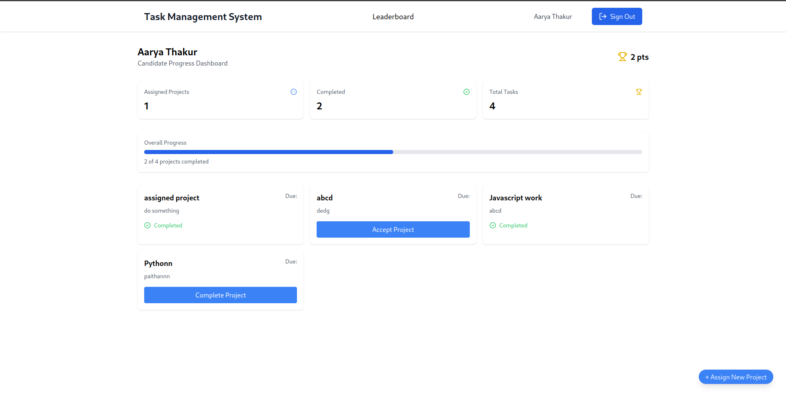

# Task Management System

## Project Description

The Task Management System is a platform designed to help organizations manage projects, assign tasks to candidates, and track their progress. It consists of two main parts:

### 1. **Project Assignment **

This allows candidates to:

-   View projects that are assigned to them.
-   Accept or decline assigned projects.

### 2. **Progress Tracking and Scoring **

This tracks the progress of each user on assigned tasks. It also calculates scores based on how many tasks the user completes, with real-time updates on their progress.

-   Tracks completed tasks and updates them in real-time.
-   Calculates scores based on task completion.
-   Displays the progress dynamically on the front-end.
-   Displays a leaderboard on the the front-end.

## Key Features Walkthrough

### 1. **User Authentication**

-   Users sign in using Google OAuth, facilitated by Firebase Authentication.
-   After logging in, users are directed to the home page where they can view their assigned projects.



### 2. **Project Assignment**

-   Projects are displayed in the form of a list for users, showing details like title, description, and status.
-   Users can accept projects, and the system updates their status accordingly.
    

### 3. **Progress Tracking**

-   Completed tasks are tracked in real-time using Firebase Firestore.
-   Users can view their progress and completed tasks dynamically.

### 4. **Leaderboard**

-   The leaderboard page displays rankings based on completed tasks.
-   The currently logged-in user is highlighted for easy recognition.
-   The leaderboard is dynamically updated as users complete tasks.
    

    

## Technologies Used

-   **Frontend:**
    -   React.js
-   **Backend:**
    -   Firebase

## Setup and Installation

### Steps to Run the Application Locally

1. **Clone the repository**:

    ```bash
    git clone https://github.com/rya23/project-management
    cd project-management
    ```

2. **Install dependencies**:
   Run the following command to install required dependencies:

    ```bash
    npm install
    ```

3. **Setup Firebase Configuration**:

    - Create a `.env` file in the root of your project.
    - Add your Firebase credentials to the `.env` file:

4. **Run the application**:
   After setting up the `.env` file, you can run the development server:

    ```bash
    npm run dev
    ```

    Visit `http://localhost:5173` in your browser to view the application.

## Features

### 1. Project Management

-   Admin can assign projects to candidates.
-   Candidates can view, accept, and track projects.
-   Projects are tied to user accounts, ensuring that each user only sees their own assigned tasks.

### 2. Progress Tracking

-   Each user's progress is tracked based on tasks they complete.
-   Scoring mechanism that assigns points for completed tasks.
-   A leaderboard to rank candidates based on their progress and completed tasks.

### 3. Leaderboard

-   Displays the ranking of users based on their completed tasks.
-   Current user is highlighted for easy identification.
-   Data is dynamically updated and shows the most recent changes.

### 4. Authentication and Authorization

-   Users sign in with Google authentication.
-   Firebase is used to handle authentication, database management, and data storage.
